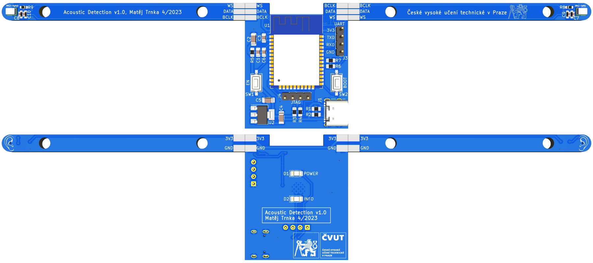

# System for Acoustic Detection and Localization Based on Two Microphones
# Systém pro akustickou detekci a lokalizaci založený na dvou mikrofonech

This repository contains the source code, schematic, and PCB layout of a demonstration device designed to detect and locate acoustic impulse events. The device is composed of an ESP32 microcontroller and two MEMS microphones SPH0645LM4H.

## Directories
- `AcousticDetection_HW/` - KiCad schematic & PCB
- `AcousticDetection_SW/` - source code of the ESP32 firmware
- `web` - source the web page for ESP32
- `models` - 3D models for 3D printing
- `dsp_toolbox/` - some tools used during development of the signal processing